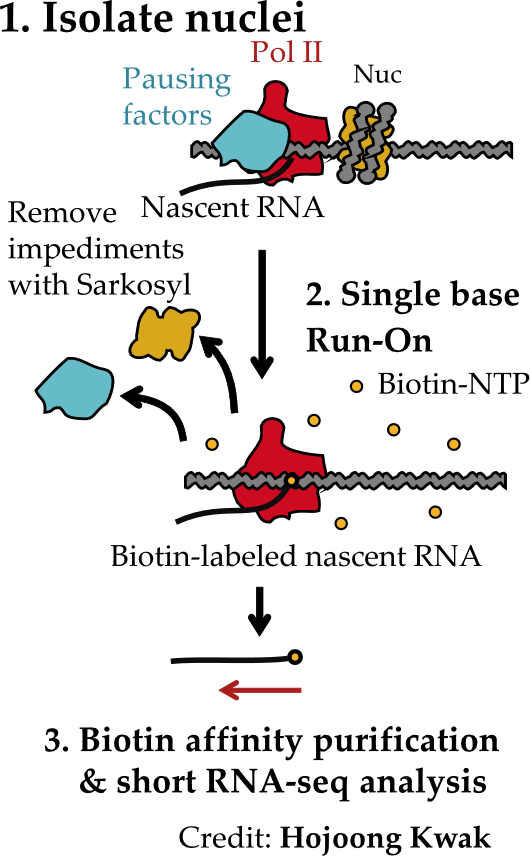

Analyzing PRO-seq data.
=======================

Global Run-On and Sequencing (GRO-seq) and Precision Run-On and Sequencing (PRO-seq) are technologies for mapping 
the location and orientation of actively transcribing RNA polymerase I, II, and III (Pol) across the genome.  Both
technologies are particular powerful because they provides a genome-wide readout of gene and lincRNA transcription, 
and the location and relative activities of active enhancers and promoters that regulate gene transcription.

Danko lab generally uses PRO-seq.  This tutorial describes the basic analysis pipeline used in the Danko lab.

Basic experimental design
-------------------------

GRO-seq and PRO-seq were developed by Leighton Core and Hojoong Kwak while working in John Lis' lab at Cornell.  A 
schematic of the PRO-seq protocol is shown in Fig. 1.  PRO-seq begins using cell nuclei isolated from a cell 
population of interest (step #1).  RNA polymerases are halted by depleting rNTP monomers that are polymerized in 
RNA.  RNA polymerases incorporate a single biotin-labeled rNTP (step #2). Nascent RNAs are purified using 
streptavidin beads, and deep sequenced using Illumina technology.

      

Read mapping and data visualization
-----------------------------------

Coming soon.

Identifying regulatory elements using dREG
------------------------------------------

Coming soon.

Working with data using the bigWig package for R
------------------------------------------------

Coming soon.

Testing for changes between conditions
--------------------------------------

Coming soon.

Useful references
-----------------

- [ ] GRO-seq: http://www.sciencemag.org/content/322/5909/1845.long
- [ ] PRO-seq: http://www.ncbi.nlm.nih.gov/pmc/articles/PMC3974810/
- [ ] dREG: http://www.nature.com/nmeth/journal/v12/n5/full/nmeth.3329.html
