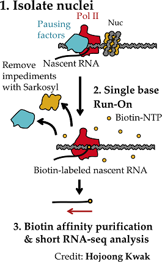

Analyzing PRO-seq data.
=======================

Global Run-On and Sequencing (GRO-seq) and Precision Run-On and Sequencing (PRO-seq) are technologies for mapping 
the location and orientation of actively transcribing RNA polymerase I, II, and III (Pol) across the genome.  Both
technologies are particular powerful because they provide a genome-wide readout of gene and lincRNA transcription, 
as well as the location and relative activities of active enhancers and promoters that regulate transcription.

The Danko lab generally uses PRO-seq.  This tutorial describes the basic analysis pipeline used in the <a href="http://www.dankolab.org">Danko lab</a>.

Basic experimental design
-------------------------



GRO-seq and PRO-seq were developed by Leighton Core and Hojoong Kwak while working in John Lis' lab at Cornell.  A schematic of the PRO-seq protocol is shown in Fig. 1 (left).  PRO-seq begins using nuclei isolated from a cell population of interest (step #1).  RNA polymerases are halted by depleting rNTP monomers.  Engaged RNA polymerases incorporate a single biotin-labeled rNTP (step #2) in a run-on reaction that is conducted in the presence of detergents which remove impediments to Pol II transcription and prevent new initiation. Incorporation of a biotin labeled nucleotide stalls RNA polymerase after a single nucleotide is incorporated, resulting in single-nucleotide resolution map of the location and orientation of actively transcribing RNA polymerases across the genome.  Nascent RNAs are purified using streptavidin beads, amplified by PCR, and deep sequenced using Illumina technology (step #3).

<BR><BR>

Read mapping
------------
New version of read mapping is HERE <https://github.com/Danko-Lab/proseq2.0>

The Danko lab pipeline for aligning PRO-seq data can be found here: https://github.com/Danko-Lab/utils/tree/master/proseq.  The script will automate three routine pre-processing and alignment options, including pre-processing reads and trimming the sequencing adapter (cutadapt), mapping reads to a reference genome (BWA), and converting BAM files into bedGraph and BigWig formats (kentsource).  After running this script, users should have processed data files in the specified output directory.

Note that the process for GRO-seq data is very similar in most respects, but does not require switching the strand of reads after mapping.  We will post a pipeline for aligning GRO-seq data to GitHub soon.

To run our pipeline users must first download the script files and install dependencies indicated in the README.md.  Two additional options are required to run proseqMapper.bsh, including a path to a BWA index file (generated using the 'bwa index' command), and the path to the chromInfo file for the genome of choice.

The proseqMapper.bsh script is run using: 

``` bash proseqMapper.bsh --bwa-index=/bwa/index/file/bwa-index --chrom-info=/chrom/info/file/chrom.info```

For help with the proseqMapper.bsh, or to see a complete list of options, type: 

``` 
$ bash proseqMapper.bsh --help

Preprocesses and aligns PRO-seq data.

Takes *.fastq.gz in the current working directory as input and writes
BAM and bedGraph files to the current working directory as output.

bash proseqMapper.bsh [options] [files]

options:
-h, --help                show brief help.

-i, --bwa-index=PATH      path to the BWA index of the target genome (i.e., bwa index).
-c, --chrom-info=PATH     location of the chromInfo table.
-T, --tmp=PATH            path to a temporary storage directory.
-o, --output-dir=DIR      specify a directory to store output in.
-I, --fastq=PREFIX        Prefix for input files.

-q, --qc                  writes out standard QC plots.
-b6, --barcode6           collapses unique reads and trims a 6bp barcode.
-G, --map5=TRUE|FALSE     maps the 5' end of reads, for GRO-seq [default == FALSE]

```

The script requires two parameters for genome information, including BWA index (--bwa-index) and chromosome size (--chrom-info). For GRO-seq process, '-G' should be specified.

Notes for **CBSUdanko** users:
``` 
(1) BWA index for hg19: 
    CBSUdanko:/storage/data/short_read_index/hg19/bwa.rRNA-0.7.5a-r405/hg19.rRNA.bwt
(2) Chromosome table for hg19:
    CBSUdanko:/storage/data/hg19/hg19.chromInfo
(3) Add UCSC tools to your path (.bashrc file)
    export PATH=$PATH:/home/lac334/ucsc_tools
``` 

PRO-seq quality control (QC)
----------------------------

So you've got libraries back and you want to know whether they will work for you!  There are two QC metrics that we find useful to determine the quality of PRO-seq libraries:

* First, we calculate the size distrubtion of sequence fragments after trimming adapters.  Degraded libraries will tend to have a shorter length distribution, and this will show up when viewing the histograms (below). 
* Second, we compute a metric that relates to library complexity, or the number of unique seuqneces fragments represented as the entire library is sequenced. This was initially developed by [Corcra](https://github.com/corcra/bed-metric).

Both of these quality metrics are integrated into the PRO-seq alignment pipeline using the option -q or --qc.  

Alterantively, the QC script can be run separately.

Identifying regulatory elements using dREG
------------------------------------------

dREG takes as input .bigWig files output after mapping PRO-seq reads to the reference genome and a pre-trained support vector regression (SVR) model.  

* PRO-seq files are required to be in the bigWig format standard created by the UCSC (more information can be found here: http://genome.ucsc.edu/goldenPath/help/bigWig.html). 
* We suggest to use this script to prepare your PRO-seq, GRO-seq, or ChRO-seq data in bigWig format. 
  https://github.com/Danko-Lab/tutorials/blob/master/PRO-seq.md#read-mapping 

* The SVR model contained in the dREG  package (under dREG_model/asvm.RData) is a simple model. Users are advised to use that followed with dREG-HD package when possible.

* The well-trained model can be downloaed from FTP, users are advised to do peak calling directly using this model.
  ftp://cbsuftp.tc.cornell.edu/danko/hub/dreg.models/asvm.gdm.6.6M.20170828.rdata. 

To do peak calling with dREG, type: 

    bash run_peakcalling.bsh plus_strand.bw minus_strand.bw out_prefix asvm.RData [nthreads] [GPU]

    plus_strand.bw	-- PRO-seq data (plus strand) formatted as a bigWig file.
    minus_strand.bw	-- PRO-seq data (plus strand) formatted as a bigWig file.
    out_prefix      -- The prefix of the output file.
    asvm.RData      -- The path to the RData file containing the pre-trained SVM.
    [nthreads]      -- [optional, default=1] The number of threads to use.
    [GPU]           -- [optional, default=_blank_] GPU can be used with the aid of the Rgtsvm package.

For more information see the dREG usage instructions, here: https://github.com/Danko-Lab/dREG/blob/master/README.md

Data visualization
------------------

Coming soon.

Working with data using the bigWig package for R
------------------------------------------------

Coming soon.

Transcription Unit Identification
---------------------------------

Coming soon.

Testing for changes between conditions
--------------------------------------

Coming soon.

Useful references
-----------------

* GRO-seq: http://www.sciencemag.org/content/322/5909/1845.long
* PRO-seq: http://www.ncbi.nlm.nih.gov/pmc/articles/PMC3974810/
* dREG: http://www.nature.com/nmeth/journal/v12/n5/full/nmeth.3329.html
